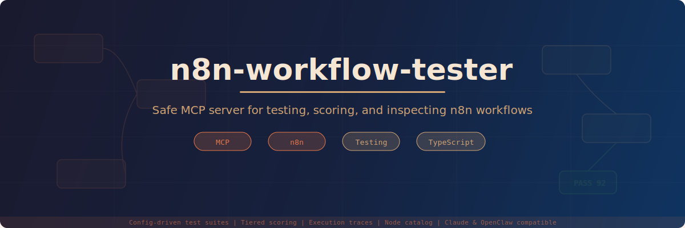

<p align="center">
  
</p>

<p align="center">
  <a href="https://opensource.org/licenses/MIT"></a>
  <a href="https://modelcontextprotocol.io"></a>
  <a href="https://www.typescriptlang.org"></a>
  <a href="https://n8n.io"></a>
</p>

<p align="center">
  <strong>Safe MCP server + CLI for testing, scoring, and inspecting n8n workflows</strong><br/>
  <em>Config-driven test suites with tiered scoring, execution traces, and a built-in node catalog.</em>
</p>

<a href="https://glama.ai/mcp/servers/Souzix76/n8n-workflow-tester-safe">
  
</a>

---

## Why?

Most n8n MCP integrations give you **full admin access** — credentials, destructive operations, auto-fix loops. That's fine for development, but risky for CI, shared environments, or autonomous agents.

`n8n-workflow-tester-safe` takes a different approach:

| Feature | This MCP | Full admin MCPs |
|---------|----------|-----------------|
| Test workflows with scoring | Yes | No |
| Execution traces (lightweight) | Yes | No |
| Node catalog with suggestions | Yes | No |
| Credential management | **Excluded** | Yes |
| Secret lifecycle | **Excluded** | Yes |
| Auto-fix loops | **Excluded** | Some |

**Result:** A focused tool that does testing and inspection really well, without the risk surface of a full admin wrapper.

---

## Quick Start

### 1. Install

```bash
git clone https://github.com/souzix76/n8n-workflow-tester-safe.git
cd n8n-workflow-tester-safe
npm install && npm run build
```

### 2. Configure

```bash
cp .env.example .env
# Edit .env with your n8n URL and API key
```

```env
N8N_BASE_URL=http://127.0.0.1:5678
N8N_API_KEY=your_n8n_api_key_here
DEFAULT_TIMEOUT_MS=30000
```

### 3. Run

**As MCP server** (for Claude, OpenClaw, or any MCP client):

```bash
node dist/index.js
```

**As CLI** (for scripts and CI):

```bash
node dist/cli.js --config ./workflows/example.json
```

---

## MCP Client Configuration

### Claude Code (`~/.claude.json`)

```json
{
  "mcpServers": {
    "n8n-workflow-tester": {
      "type": "stdio",
      "command": "node",
      "args": ["/path/to/n8n-workflow-tester-safe/dist/index.js"],
      "env": {
        "N8N_BASE_URL": "http://localhost:5678",
        "N8N_API_KEY": "your_api_key"
      }
    }
  }
}
```

### OpenClaw / Any MCP client

The server uses **stdio transport** — compatible with any MCP client that supports stdio.

---

## How It Works

### Test Config

Define your tests in a JSON file:

```json
{
  "workflowId": "abc123",
  "workflowName": "my-webhook-handler",
  "triggerMode": "webhook",
  "webhookPath": "/webhook/my-handler",
  "timeoutMs": 15000,
  "qualityThreshold": 85,
  "testPayloads": [
    {
      "name": "happy-path",
      "data": { "message": "Hello", "userId": "user_001" }
    },
    {
      "name": "empty-input",
      "data": { "message": "" }
    },
    {
      "name": "large-payload",
      "data": { "items": ["a","b","c","d","e","f","g","h","i","j"] }
    }
  ],
  "tier3Checks": [
    {
      "name": "has-response",
      "field": "output",
      "check": "not_empty",
      "severity": "error"
    },
    {
      "name": "response-length",
      "field": "output.message",
      "check": "min_length",
      "value": 5,
      "severity": "warning",
      "message": "Response too short"
    }
  ]
}
```

### Scoring System

Every test run produces a **two-tier score**:

```
Final Score = (Tier 1 x 70%) + (Tier 3 x 30%)
```

| Tier | Weight | What it checks |
|------|--------|----------------|
| **Tier 1** (Infrastructure) | 70% | HTTP success, timeout compliance, non-empty output |
| **Tier 3** (Quality) | 30% | Custom field checks: contains, equals, min/max length, not_empty |

A test **passes** when:
- Tier 1 score = 100 (all infrastructure checks pass)
- Final score >= quality threshold (default 85)
- No issues with severity `error`

### Example Output

```json
{
  "passed": true,
  "score": 93,
  "tier1Score": 100,
  "tier3Score": 80,
  "issues": [
    {
      "tier": "tier3",
      "severity": "warning",
      "check": "response-length",
      "message": "Response too short"
    }
  ]
}
```

---

## Tools Reference

### Testing (3 tools)

| Tool | Description |
|------|-------------|
| `test_workflow` | Run a single payload test from a config file |
| `evaluate_workflow_result` | Run a test and return evaluation score + issues |
| `run_workflow_suite` | Run all payloads in a config, return per-payload scores |

### Workflow Operations (5 tools)

| Tool | Description |
|------|-------------|
| `create_workflow` | Create a new workflow from JSON |
| `update_workflow` | Replace an existing workflow by ID |
| `delete_workflow` | Delete a workflow by ID |
| `add_node_to_workflow` | Append a node to an existing workflow |
| `connect_nodes` | Create a connection between two nodes |

### Introspection (5 tools)

| Tool | Description |
|------|-------------|
| `get_workflow_summary` | Compact summary: node count, names, types, disabled status |
| `list_node_types` | List all available node types from the n8n instance |
| `get_node_type` | Full schema/metadata for a specific node type |
| `list_executions` | Recent executions, filterable by workflow and status |
| `get_execution` | Full execution data by ID |
| `get_execution_trace` | **Lightweight per-node trace** — timing, errors, item counts |

### Catalog (5 tools)

| Tool | Description |
|------|-------------|
| `get_catalog_stats` | Node/trigger/credential counts from imported catalog |
| `search_nodes` | Fuzzy search by name, optional trigger-only filter |
| `list_triggers` | All trigger nodes from the catalog |
| `validate_node_type` | Check if a node type exists, get close matches |
| `suggest_nodes_for_task` | Natural-language task in, relevant nodes out |

---

## Example Configs

The `workflows/` directory includes ready-to-use test configs:

| File | Trigger Mode | Payloads | Description |
|------|-------------|----------|-------------|
| `example.json` | webhook | 2 | Basic webhook echo test |
| `telegram-bot.json` | webhook | 3 | Telegram bot command handler |
| `api-pipeline.json` | execute | 3 | Multi-step API data pipeline |

---

## Architecture

```
src/
  index.ts        MCP server (stdio) + tool registration
  cli.ts          CLI runner for config-driven tests
  n8n-client.ts   REST client for n8n API v1
  evaluator.ts    Two-tier scoring engine
  catalog.ts      Node catalog parser + fuzzy search
  config.ts       JSON config reader + Zod validation
  types.ts        TypeScript interfaces

catalog/          Imported n8n node catalog (436 nodes, 389 credentials)
workflows/        Example test suite configs
```

### Design Constraints

- **stdio-only transport** — no HTTP server, no auth to manage
- **Explicit tool surface** — 19 tools, each with a clear purpose
- **Small dependency footprint** — only `@modelcontextprotocol/sdk` and `zod`
- **No credential lifecycle** — won't read, create, or delete credentials
- **No agentic auto-repair** — reports issues, doesn't auto-fix them

---

## Safety Posture

### Included
- Workflow test execution (webhook + API)
- Output evaluation with tiered scoring
- Workflow CRUD (create, read, update, delete)
- Graph editing (add nodes, connect)
- Execution inspection and tracing
- Node catalog lookup and validation

### Deliberately Excluded
- Credentials management
- Secrets lifecycle
- Destructive restore flows
- Autonomous LLM auto-fix loops
- Production deployment operations

---

## Roadmap

- [ ] Read-only mode flag (disable all mutation tools)
- [ ] Workflow diff summaries (before/after comparison)
- [ ] Reusable evaluation presets for common patterns
- [ ] Richer trace visualization
- [ ] Fixture libraries for test payloads
- [ ] npm package for `npx` usage

---

## Contributing

1. Fork the repo
2. Create a feature branch (`git checkout -b feat/my-feature`)
3. Commit changes (`git commit -m 'feat: add my feature'`)
4. Push to branch (`git push origin feat/my-feature`)
5. Open a Pull Request

---

## License

[MIT](LICENSE)

---

<p align="center">
  Originally created by James (<a href="https://openclaw.org">OpenClaw</a>). Enhanced and maintained by <a href="https://github.com/Souzix76">Souzix76</a>.<br/>
  Built for <a href="https://n8n.io">n8n</a> operators who want testing without the risk surface.<br/>
  Compatible with <a href="https://claude.ai">Claude</a>, <a href="https://openclaw.org">OpenClaw</a>, and any MCP client.
</p>